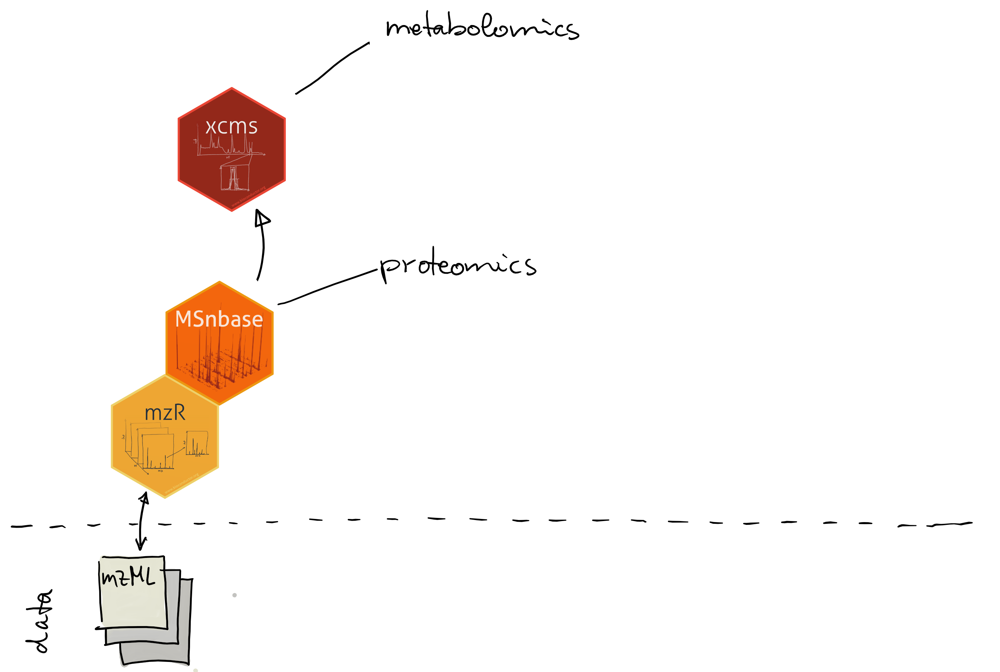
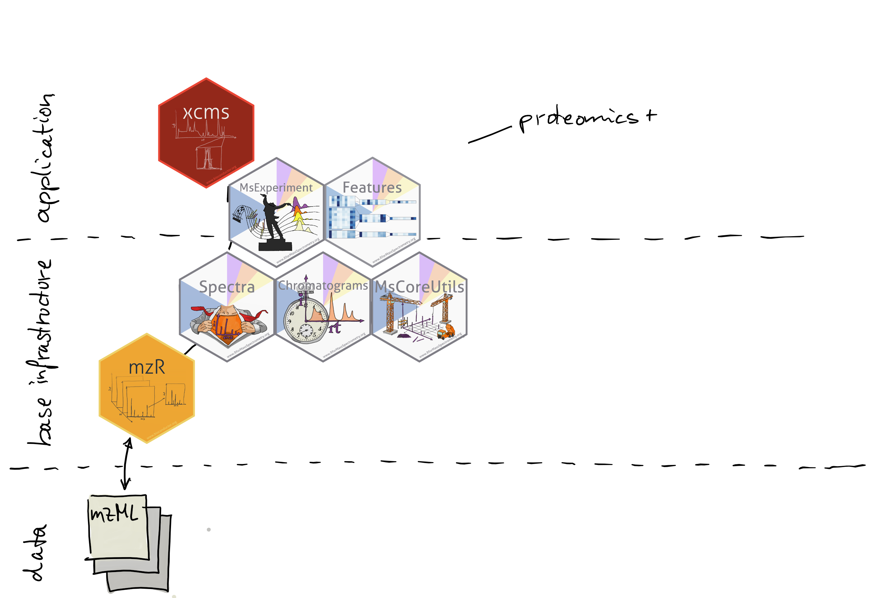
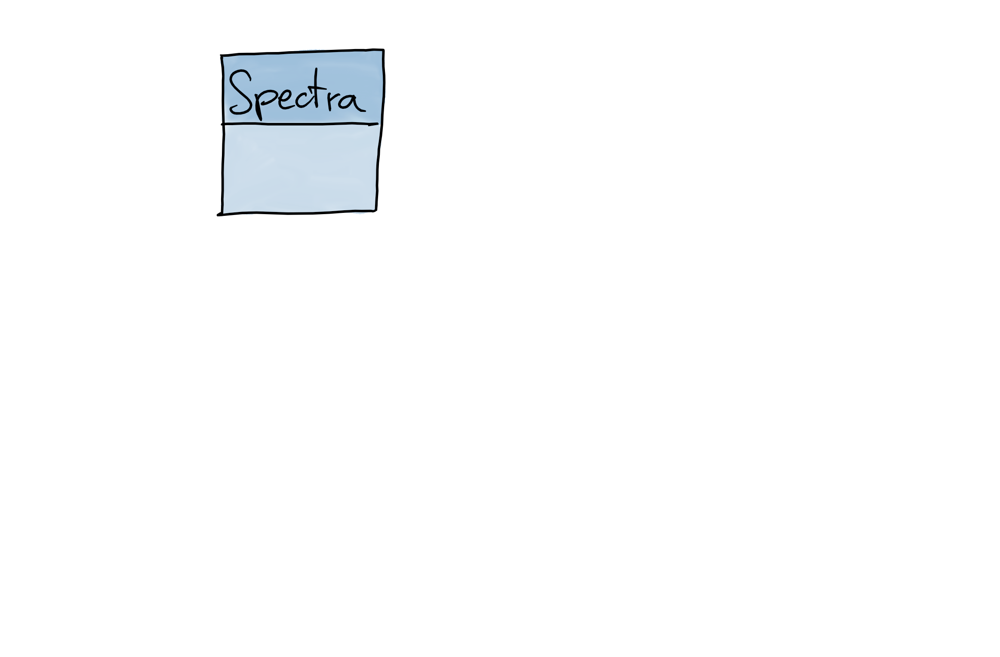
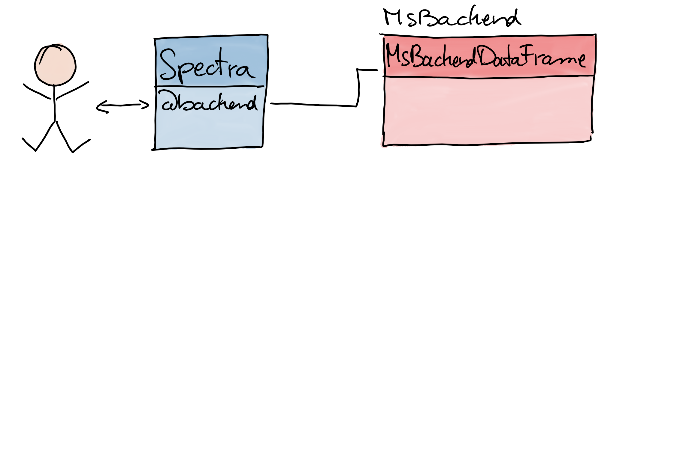
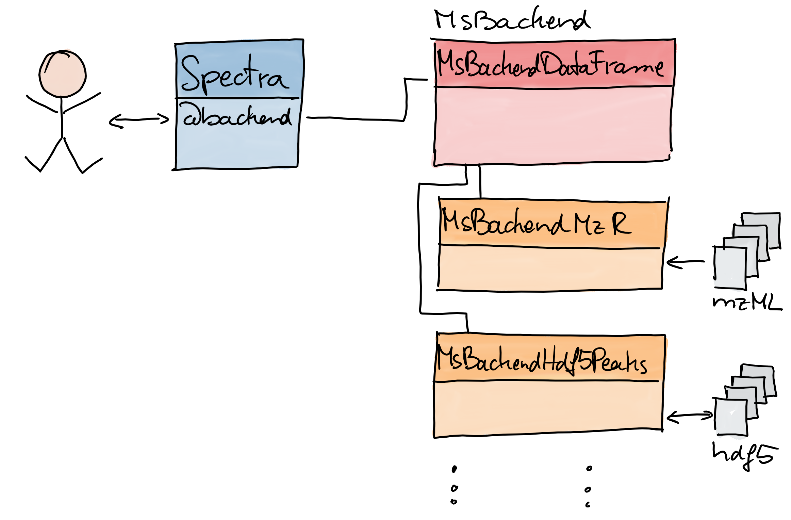
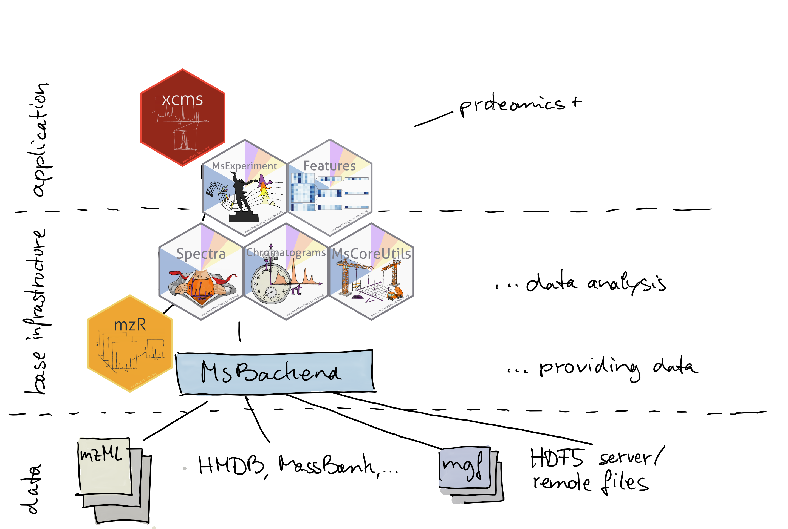

<style type="text/css">

slides > slide:not(.nobackground):after {
  content: '';
}

slides > slide {
    -webkit-transition:none !important;transition:none !important;
}

.build > * {
  -webkit-transition: opacity 0.1s ease-in-out;
  -webkit-transition-delay: 0.1s;
  -moz-transition: opacity 0.1s ease-in-out 0.1s;
  -o-transition: opacity 0.1s ease-in-out 0.1s;
  transition: opacity 0.1s ease-in-out 0.1s;
}

</style>

<!--
Export to pdf:
webshot function from webshot package.
Might have to change stuff in the style sheet to make it working.
library(webshot)
install_phantomjs()
rmdshot("Spectra.Rmd", "Spectra.pdf")
-->

## RforMassSpectrometry

```{r out.width = "300px", echo = FALSE}

```

- [Initiative](https://www.rformassspectrometry.org) to create a
  flexible and scalable infrastructure for MS data.
- See Laurent Gatto's [poster](https://doi.org/10.5281/zenodo.3565530) for
  details.


## Status quo

```{r out.width = "700px", echo = FALSE}

```

## The plan {.smaller}

```{r out.width = "700px", echo = FALSE}

```

## The plan {.smaller}

```{r out.width = "700px", echo = FALSE}

```

<div style="position:absolute; top:80%; left:33%;">
- Splitting `MSnbase` simplifies re-use of functionality.
- Get *real* infrastructure for MS data.
</div>

##

```{r out.width = "480px", echo = FALSE}
knitr::include_graphics("images/Spectra.png")
```

## Mass spectrum {.build}

<div>
<div>
```{r out.width = "500px", echo = FALSE}

```
</div>
<div style="position:absolute; top:55%; left:7%;">
- Spectrum:
  - 2 `numeric`: m/z and intensity values.
  - additional metadata information.
- `MSnbase`: `Spectrum` object for a single spectrum.
</div>
</div>

## Mass spectrum

<div>
```{r out.width = "500px", echo = FALSE}

```
... but usually we deal with many spectra ...
</div>

## Think bigger: `Spectra`

<div>
```{r out.width = "500px", echo = FALSE}

```
</div>

<div style="position:absolute; top:70%;">
- One object to represent data from one or many spectra.
</div>

## Think flexible: `MsBackend`

<div>
```{r out.width = "500px", echo = FALSE}

```
</div>

<div style="position:absolute; top:70%;">
- Separate user functionality from data handling and storage.
</div>

## Think flexible: `MsBackend`

<div>
```{r out.width = "500px", echo = FALSE}

```
</div>

<div style="position:absolute; top:70%;">
- Separate user functionality from data handling and storage.
- Enables use of different *backends* (in-memory/on-disk, remote files,
  SQL-based, ...).
</div>

## The whole picture

```{r out.width = "700px", echo = FALSE}

```


## The interactive part

Installation instructions:
```{r eval = FALSE}
install.packages("BiocManager")
BiocManager::install(c("remotes", "magrittr", "rmarkdown"))
BiocManager::install("RforMassSpectrometry/Spectra")
BiocManager::install("RforMassSpectrometry/MsBackendHmdb")
BiocManager::install(c("mzR", "BiocStyle"))
```

Get the data and code:

`git clone https://github.com/jorainer/spectra_workshop`

